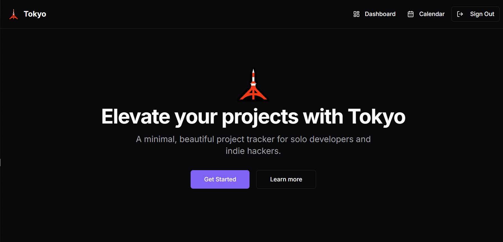

# Tokyo 🗼 – Your AI-Powered Project Management Assistant

**Tokyo** is a sleek, AI-integrated project management tool designed specifically for solo developers and indie hackers. It helps you manage your development projects, track tasks, organize your tech stack, and use intelligent automation to stay on top of your game.

 <!-- Optional: Add a visual banner or screenshot -->

---

## 🚀 Features

### 🔧 Core Functionalities

#### 🗂️ Project Management
- Create, view, update, and delete software development projects
- Track project status: `Planning`, `In Progress`, `Completed`, `On Hold`
- Set project priorities: `Low`, `Medium`, `High`
- Manage associated tech stacks (e.g., React, Node.js, PostgreSQL)
- Link GitHub repositories and deployment URLs for each project

#### ✅ Task Management
- Add and organize tasks per project
- Mark tasks as complete/incomplete
- Set priority and due dates
- Get insights into task progress and completion status

#### 🔐 Authentication
- GitHub OAuth via **Supabase**
- Email/password sign-in for flexibility
- All routes and project/task data are securely protected for authenticated users

---

## 🧠 Upcoming AI Features (WIP)

We're integrating **Google Gemini API** and **OpenAI** to bring powerful AI assistance into your workflow:

### 🗺️ Roadmap Generator
- Generate milestone plans automatically from project descriptions
- Get timeline suggestions and phases instantly

### 📌 Task Breakdown
- Convert feature ideas into granular, actionable subtasks
- Automatically assign priorities and ordering

### 📊 Commit Summarizer
- Pull and summarize recent GitHub commits
- Display human-readable summaries grouped by purpose or context

### ⏳ Stagnation Detection
- Detect inactive or stale projects
- Receive nudges or motivational notes with action suggestions

### ⚖️ Smart Task Prioritization
- AI-powered priority recommendation based on task wording and project phase

---

## 🏗️ Tech Stack

| Layer        | Technology                                |
| ------------ | ------------------------------------------ |
| Frontend     | React + TypeScript                        |
| Styling      | Tailwind CSS + shadcn/ui                  |
| Backend/API  | Supabase (Auth + DB + REST)               |
| State Mgmt   | React Query                               |
| Routing      | React Router                              |
| AI Layer     | Google Gemini API & OpenAI (WIP)          |
| Hosting      | Vercel                                     |

---

## 🔧 Local Development Setup

### 1. Clone the repository

```bash
git clone https://github.com/albinxavierdev/tokyo.git
cd tokyo
```

### 2. Install dependencies

```bash
npm install # or yarn
```

### 3. Set up environment variables

Create a `.env` file and copy contents from `.env.example`. Configure:

```env
VITE_SUPABASE_URL=
VITE_SUPABASE_ANON_KEY=
VITE_OPENAI_API_KEY=
VITE_GEMINI_API_KEY=
```

### 4. Run the development server

```bash
npm run dev
# or
yarn dev
```

---

## 🧪 Testing (Coming Soon)

Unit and integration testing will be added using:

- Jest
- React Testing Library

---

## 🌐 Live Demo

Check out the live version: https://tokyodev.vercel.app

---

## 🧩 Contributing

Want to contribute? Pull requests are welcome!
Please check the issues tab for bugs and feature requests.

### Steps:
1. Fork the repository
2. Create your feature branch (`git checkout -b feature/cool-feature`)
3. Commit your changes
